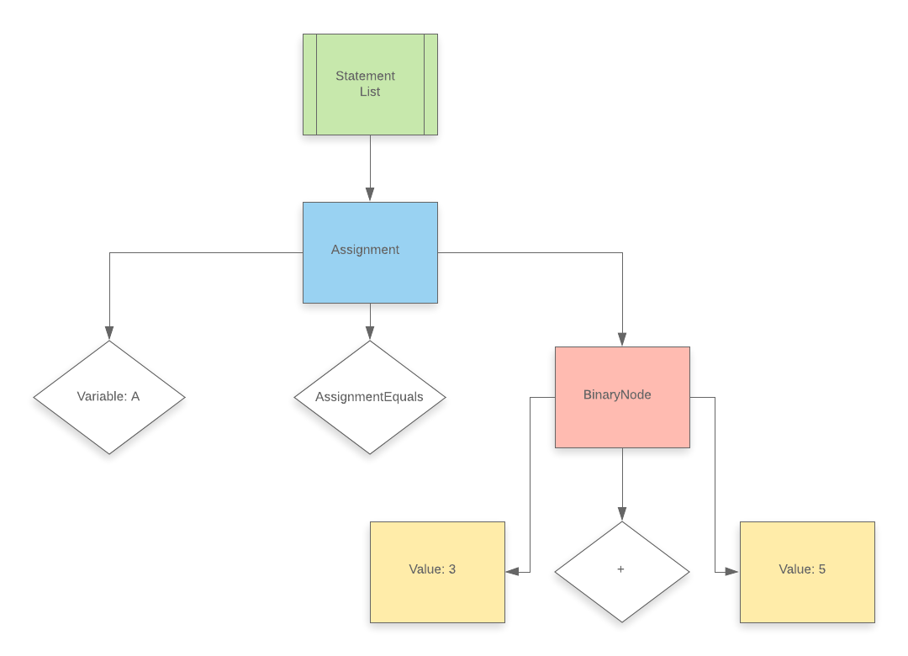

# RivdInterpreter
A simple Abstract-Syntax-Tree (AST) Walker Interpreter and Parser for the Rivd Programming Language

## The Rivd Language

### What is Rivd?
Rivd (Pronounced Rift) is a small programming language I created for this project

### Syntax
Since Rivd is a high-level language, it's syntax is pretty simple. Its something between Javascipt and Python. Here is some Rivd code as an example:

```go
#This is a comment#

func plus(a,b){
    return (a+b);
}

a = 5;
b = 0;

for (i : 0 to 10){
    b += 1.5;
}

if (plus(a,b) <= a*b){
    return 1;
} else {
    return 0;
}
```

### Currently Implemented Features
 - Arithmetic Binary Expressions (eg: `3 + 5`, `1 * 3`)
 - Arithmatic Unary Expressions (eg: `-3`)
 - Logical Binary Expressions (eg: `5 <= 10`, `10 != 1`, `!(1==2)`)
 - If / Else statements
 - For and While loops (Including Break)
 - Stack Frame based Functions (Including Recursion)
 - Variable assignments (eg: `a=5`, `a+=5`, `a++`)

## Running
### Run Rivd Code
To run Rivd code, you can use the rivd.py file, which takes the first argument in argv as a filepath and runs that file with the interpreter
for example:
`py rivd.py file.txt`

will return the retval of file.txt
### Run the tests
Rivd has a small test suite (~20 Tests). To run it, run `pytest` in the main directory.


## The Interpreter
The interpreter consists of three main parts:

### Lexer / Tokenizer
The lexer is the part of the interpreter that takes some code as a string, and converts it to a list of Tokens.
For example, the input `a = 3 + 5;` will be converted into this token array:

```
[Token(ID, 'A'), Token(AssignmentEquals, '='), Token(Int, '3'), Token(Plus, '+'), Token(Int, '5'), Token(Semicolon, ';'), Token(EOF, 'None')]
```

The idea is that we dont want the rest of our interpreter to work with the raw strings, but with simple Tokens or Symbols, that represent the "Words" of the languge. 

### Parser
The parser takes the output of the lexer - the Token array, and uses it to create an Abstract Syntax Tree - A tree representation of the code. The parser has an understanding of the language's syntax, and it uses it to build a meaningful structure out of the token list.
For example, for the previously used token list (that was generated from `a = 3 + 5;`), the AST created will look like this:



### Runner / Interpreter
This is the part of the interpreter that actually... interpretes. The runner recursively goes over the AST, and uses a visitor pattern to "execute" each node in the AST. This way, it runs it, and generates a result. It uses the ResourceScopeManager to manage the scopes and the variables (Using a global variable table, and stack frames, which create variable scopes). For example, with the AST shown above, it will run like this:

```
Running an Statement List Node ->
Running an Assignment node -> [Token(ID, 'A') -- Token(AssignmentEquals, '=') -- BinNode(ValueNode(3) , Token(Plus, '+') , ValueNode(5))]
Running a BinNode -> [ValueNode(3) -- Token(Plus, '+') -- ValueNode(5)]
Running a value node -> [3]
Running a value node -> [5]
```

## Improvements and contributions
Some of the features that should be added are:
 - Better types
 - Strings 
 - Arrays
 - A standard library

Also, for faster code execution, a bytecode translator could be added, and then a VM that runs that bytecode could be added too.
Contributions are always welcome.

## Credits
I mainly used two blogs / books for help with the creation of this:\
[Crafting Interpreters](https://craftinginterpreters.com/), Bob Nystrom\
[Let’s Build A Simple Interpreter](https://ruslanspivak.com/lsbasi-part1/), Ruslan Spivak
